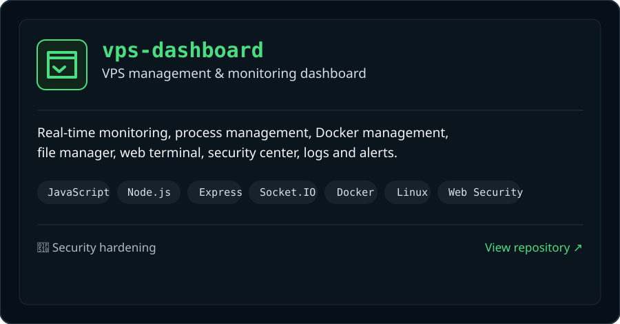
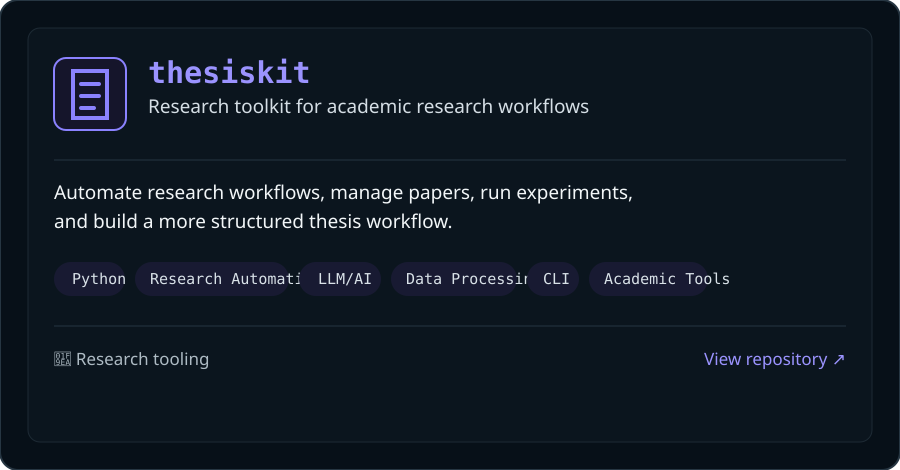

  

 

## 🚀 Featured Projects

<table>
<tr>
<td width="50%" valign="top" align="center">
  
</td>
<td width="50%" valign="top" align="center">
  
</td>
</tr>
</table>

 

<table>
<tr>
<td width="33%" valign="top">

### 🎯 Focus Areas

- Web &amp; Application Security
- Network Security
- Vulnerability Research
- Security Automation
- Linux &amp; Infrastructure
- Cloud Security
- CTF &amp; Security Research

</td>
<td width="34%" valign="top">

### 💻 Tech Stack

| Area | Stack |
|---|---|
| **Languages** | Python · Go · JavaScript |
| **Systems** | Linux · Docker · Git |
| **Web** | Node.js · Express · Socket.IO |
| **Security** | Recon · Pentest · Hardening |
| **Tools** | CLI · Bash · Wireshark · Nmap |

</td>
<td width="33%" valign="top">

### ⚡ Currently Exploring

Cybersecurity research, secure system design, vulnerability analysis, and practical security engineering.

 

</td>
</tr>
</table>

 

---

<table>
<tr>
<td width="34%" valign="middle">

### 🐙 Open source. Open mind.

Always learning. Always building.

</td>
<td width="33%" valign="middle">

### 🤝 Let's connect!

<a href="https://www.linkedin.com/in/sodiptabadiabanurea/">LinkedIn ↗</a>

📍 <strong>Jakarta, Indonesia</strong>

</td>
<td width="33%" valign="middle">

<pre>$ mission

Build it.
Break it.
Understand it.
Secure it.</pre>

</td>
</tr>
</table>

  Cybersecurity · Security Engineering · Research

