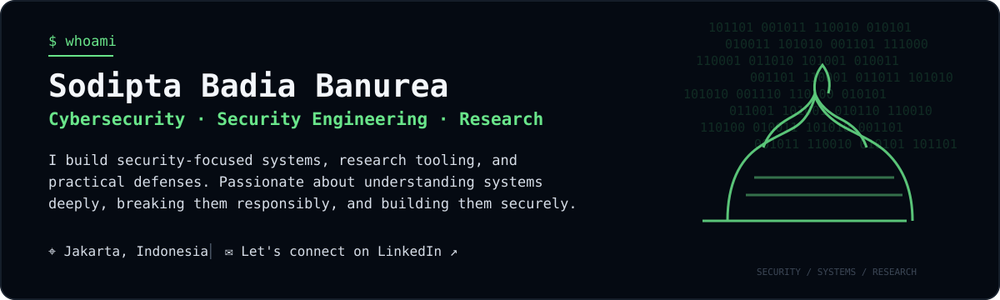
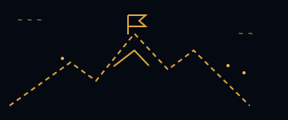

<div align="center">
  
</div>

<br>

## 🚀 Featured Projects

<table>
<tr>
<td width="50%" valign="top">

### 🖥️ [`vps-dashboard`](https://github.com/sodiptabadiabanurea/vps-dashboard)

**VPS management & monitoring dashboard** built with security in mind.

Real-time monitoring, process management, Docker management, file manager, web terminal, security center, logs, alerts, and more.

`JavaScript` `Node.js` `Express` `Socket.IO` `Docker` `Linux` `Web Security`

**[View Repository ↗](https://github.com/sodiptabadiabanurea/vps-dashboard)**

</td>
<td width="50%" valign="top">

### 📚 [`thesiskit`](https://github.com/sodiptabadiabanurea/thesiskit)

**Research toolkit** for streamlining academic research workflows and experimentation.

Automate research workflows, manage papers, run experiments, and build a more structured thesis workflow.

`Python` `Research Automation` `LLM/AI` `Data Processing` `CLI` `Academic Tools`

**[View Repository ↗](https://github.com/sodiptabadiabanurea/thesiskit)**

</td>
</tr>
</table>

<br>

<table>
<tr>
<td width="33%" valign="top">

## 🎯 Focus Areas

- Web & Application Security
- Network Security
- Vulnerability Research
- Security Automation
- Linux & Infrastructure
- Cloud Security
- CTF & Security Research

</td>
<td width="34%" valign="top">

## 💻 Tech Stack

| Area | Technologies |
|---|---|
| **Languages** | Python · Go · JavaScript |
| **Systems** | Linux · Docker · Git |
| **Web** | Node.js · Express · Socket.IO |
| **Security** | Recon · Pentest · Hardening |
| **Tools** | CLI · Bash · Wireshark · Nmap |

</td>
<td width="33%" valign="top" align="left">

## ⚡ Currently Exploring

Cybersecurity research, secure system design, vulnerability analysis, and practical security engineering.

<br>



</td>
</tr>
</table>

<br>

---

<table>
<tr>
<td width="34%" valign="middle">

### 🐙 Open source. Open mind.

Always learning. Always building.

</td>
<td width="33%" valign="middle">

### 🤝 Let's connect!

[LinkedIn](https://www.linkedin.com/in/sodiptabadiabanurea/)

📍 **Jakarta, Indonesia**

</td>
<td width="33%" valign="middle">

```text
$ mission

Build it.
Break it.
Understand it.
Secure it.
```

</td>
</tr>
</table>

<p align="center">
  <sub>Cybersecurity · Security Engineering · Research</sub>
</p>
